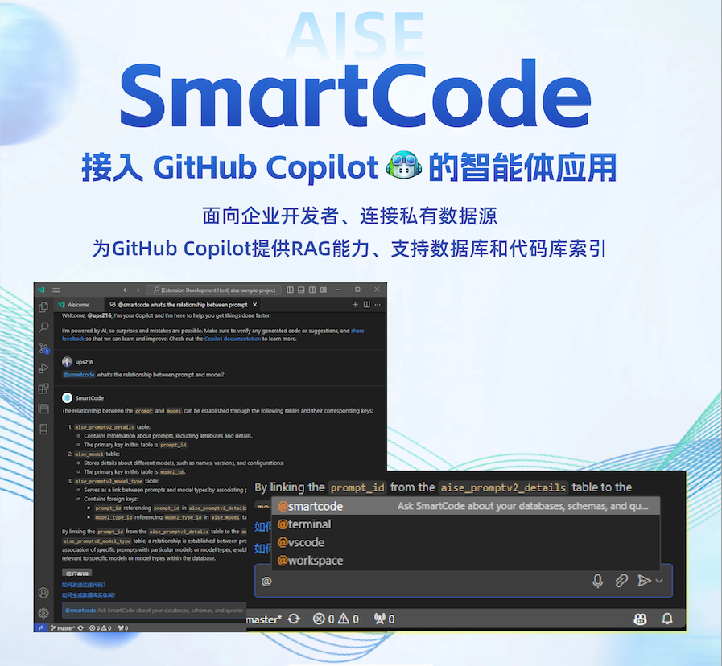
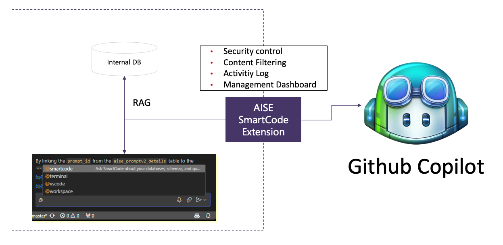

# SmartCode Lite DEMO

SmartCode Lite 是由 leansoftx.com 开发的AI辅助软件工程（AISE）系统的重要组件，也是 SmartIDE 的全新产品形态，可以为开发人员提供对软件研发过程中各阶段的AI辅助能力。

SmartCode Lite 是 SmartCode 的轻量级面向大众开发者版本，为开发者提供贴近开发环境的AI辅助能力。

本演示代码库并非SmartCode Lite的真实代码，是为了帮助开发者了解 SmartCode 产品特性而提供的示例/培训代码库。当前主要提供SmartCode for GitHub Copilot智能体扩展开发的示例代码，同时提供了详细的动手实验手册供开发者了解GitHub Copilot扩展的工作机制和开发技巧。

开发者可以使用本代码库了解体验 SmartCode 的产品能力，同时也可以用来学习开发GitHub Copilot 智能体的基本技能。

## SmartCode for GitHub 数据库智能体

SmartCode for GitHub 数据库智能体允许用户通过特定的智能体标签（@smartcode-db)在GitHub Copilot Chat中进行调用，通过对数据库结构进行向量化索引，SmartCode数据库智能体可以根据用户的问题自动定位相关数据库对象并将这些对象的描述整理成适合GitHub Copilot理解的上下文信息，最终利用GitHub Copilot后台的 GPT3.5 或者 GPT4 模型为用户生成答案。

B站演示视频链接：[国内首款GitHub Copilot智能体 SmartCode发布，构建更懂你的编程助手](https://www.bilibili.com/video/BV1Ps42137rf)

具体特性列表如下：

- 数据库问答智能体
- 在GitHub Copilot Chat中通过 @smartcode-db 调起 SmartCode数据库智能体
- 使用 query, schema, docs 三个快捷指令完成常见数据库任务
  - query: 通过自然语言生成 SQL脚本
  - schema: 针对数据库结构进行问答
  - docs: 为数据库生成文档，辅助代码生成

SmartCode 数据库智能体工作原理图：

## 实验环境

GitHub Copilot 智能体 能力当前仍然处于预览版状态，因此我们需要使用 Visual Studio Code Insider版本才能正确完成以下实验内容。

以下列出完成本实验的前置条件，请希望参与动手实验的开发人员确保自己的开发环境满足要求：

1. Visual Studio Code Insider 1.90版本以上 下载地址 https://code.visualstudio.com/insiders/
2. GitHub Copilot 账号
3. Node.js 开发环境，建议 Node 20 以上版本

## 动手实验操作手册

以下动手实验内容帮助开发者逐步完成一个GitHub Copilot插件开发的环境搭建，代码编写和场景实现过程

> 开始实验之前，请先克隆本代码库到本地，以下所有动手实验步骤都是按照本地开发环境而设计。

- [Lab01 - SmartCode for GitHub Copilot 数据库智能体使用体验](./docs/lab01/README.md)
  - [01 启动SmartCode Lite插件](./docs/lab01/01-setup.md)
  - [02 数据库基本问答](./docs/lab01/02-basic-qa.md)
  - [03 生成数据库结构化文档](./docs/lab01/03-generate-docs.md)
  - [04 利用数据库问答结果提高代码生成准确率](./docs/lab01/04-generate-code.md)

## 内测申请

SmartCode Lite 正在招募首批内测用户，请扫码加入我们的内测计划。我们会会在近期和您取得联系。

## 版权

本代码库所包含的演示代码、文档、图片和相关视频均由 [英捷创软科技（北京）有限公司](https://leansoftx.com) 拥有全部版权，任何组织和个人未经允许不得复制，修改此代码库的内容和用于任何商业用途。

Copyright @ 2024 by leansoftX.com

All rights reserved.