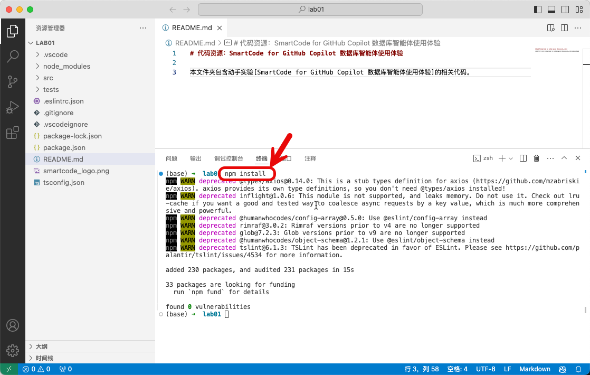
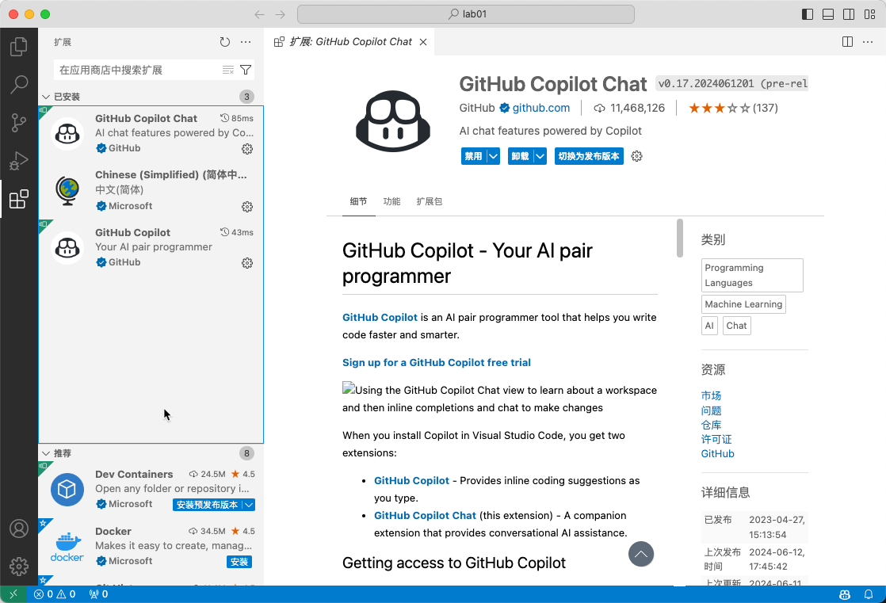
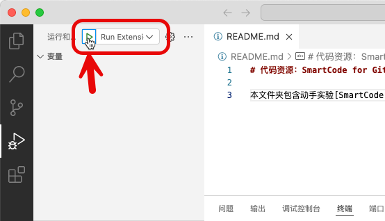
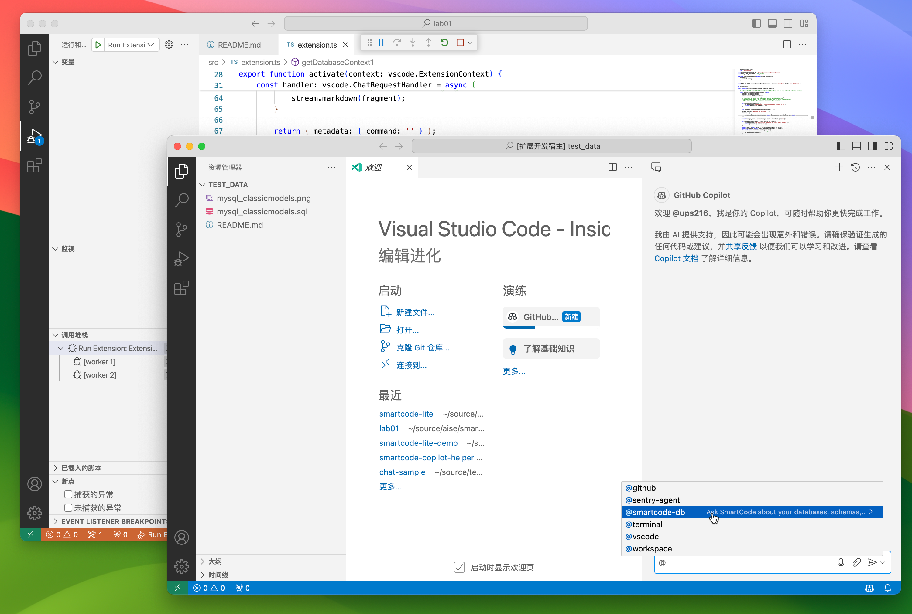

# Lab01：SmartCode for GitHub Copilot 数据库智能体使用体验

## 01 - 启动SmartCode Lite DEMO插件

在本实验中，我们将使用启动一个完成版的SmartCode Lite DEMO插件。

### 步骤 1 - 准备实验环境

请确保你准备好以下基础环境

1. Visual Studio Code Insider 1.90版本以上 下载地址 https://code.visualstudio.com/insiders/
2. GitHub Copilot 账号
3. Node.js 开发环境，建议 Node 20 以上版本

> 注意：以下提到的VSCode均指VSCode Insider。

### 步骤 2 - 获取代码并安装依赖

进入 `labs/lab01` 文件夹，使用 VSCode 打开此文件夹，并使用终端窗口运行以下指令

```shell
npm install
```



确保以上执行运行成功，没有出现任何错误。

### 步骤 3 - 安装 GitHub Copilot 插件并登录你的账号

在 VSCode 左侧的工具栏中点击 `插件` 图标，安装 GitHub Copilot 插件。

> 因为在代码中已经指定了GitHub Copilot作为依赖项，VSCode会自动启动安装动作。如果自动安装没有启动，请手工安装。

确保插件安装成功，并成功登录了自己的账号



### 步骤 3 - 启动调试

在 VSCode 左侧调试工具栏中点击 `启动调试` 按钮



确保启动 `VSCode 扩展开发宿主` 正常启动，并可以开启 Copilot Chat 窗口



点击进入下一步实验：

[下一步：02 数据库基本问答](./02-basic-qa.md)