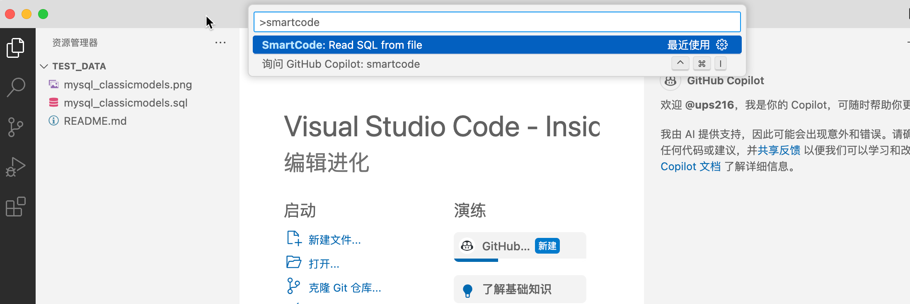
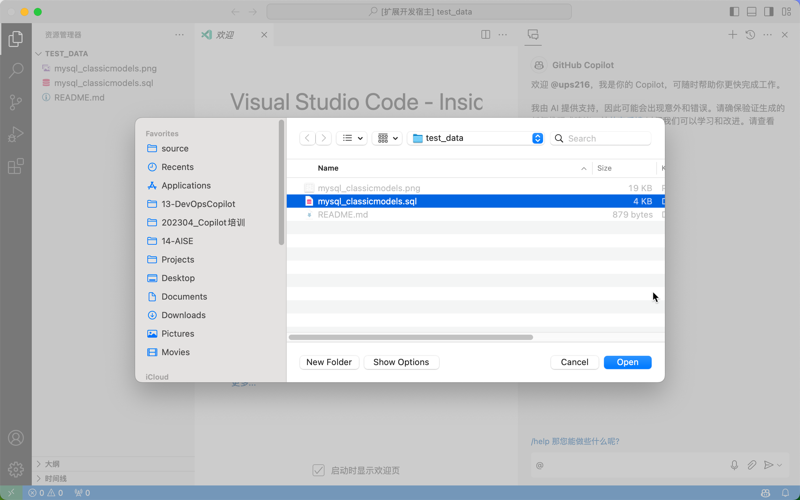
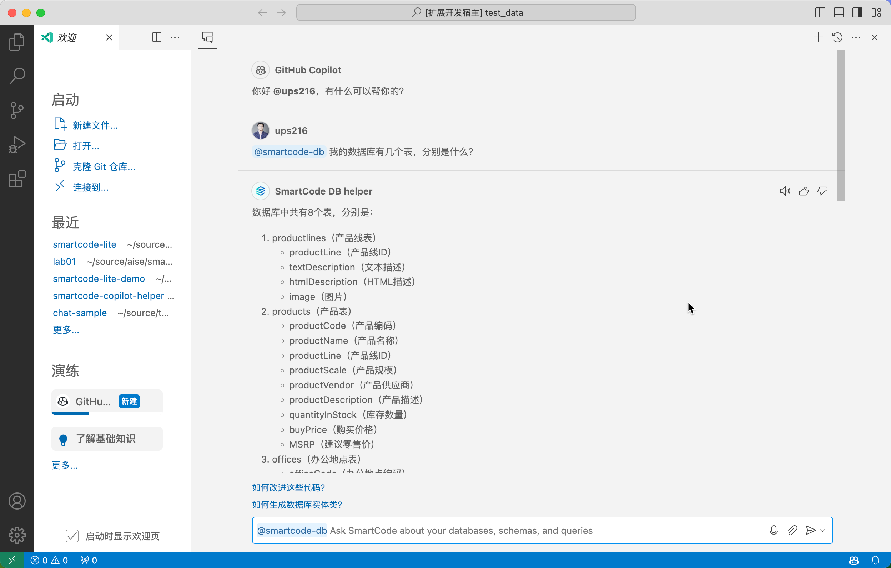
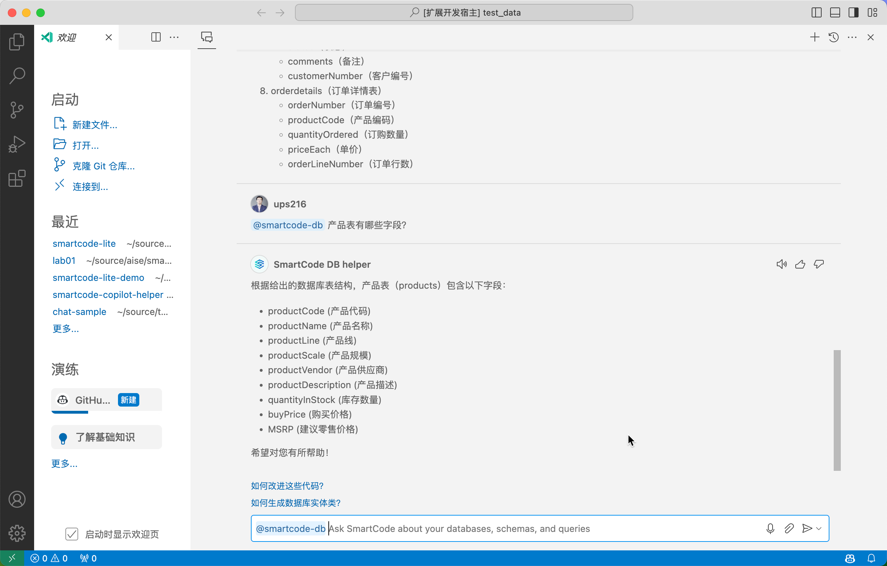

# Lab01：SmartCode for GitHub Copilot 数据库智能体使用体验

## 02 数据库基本问答

本实验中，我们将加载一个预先准备好的数据库DDL脚本，并对这个这个数据库进行一些基本的问答操作。

### 步骤 1 - 加载数据库脚本

> 在正式版的 SmartCode Lite 中，我们将允许开发人员配置数据库连接参数并自动连接到数据库获取数据库DDL脚本，同时我们还会对这些脚本进行切片和向量化操作（数据库上下文索引），以便确保我们可以处理任何规模的数据库。

本实验中，我们将使用一个预先准备好的 `.sql` 文件来模拟已经索引好的数据库上下文，这完全是为了实验简化的目的，但是这仍然可以让您体验到使用生成式AI来进行数据库结构的智能化分析后的问答效果。

在已经开启的 `VSCode扩展开发宿主` 中按下 `^+CMD+p` (mac) 或者 `Ctrl+Shift+P` (win) 来开启 `命令控制栏` ，并在其中搜索 **SmartCode** 

选中 **SamrtCode: Read SQL From File** 命令，并在弹出的文件选择窗口中选中 `/test_data/mysql_classicmodels.sql` 文件

> SmartCode 此时会检测您所选择的文件大小，并通过 `tokenzier` 来计算这个文件所占用的 token 数量，如果token数量超出了 GitHub Copilot 后台的 GPT3.5 或者 GPT4 的token数量限制，将会提示您文件过大。在我们的实验中，我们默认使用 GPT3.5 作为后台模型，这个模型的token限制是 4096。

### 步骤 2 - 向数据库提问

一旦 `.sql` 正常加载，SmartCode 就可以将这个文件内容作为上下文发送给 GitHub Copilot 来回答我们的问题了。我们可以问几个简单的问题。

> 请确保在您的问题之前加上 `@smartcode-db` 的标签，这样GitHub Copilot才能正确调用我们的插件完成数据库上下文检索。

比如：

- 我的数据库有哪些表，分别是什么？

- 产品表有哪些字段？

再比如这些关系类问题，更加能够体现生成式AI的能力，因为类似的问题通过传统的数据库工具需要比较复杂的逻辑才能实现。

- 产品和产品线之间是什么关系？
- 订单和付款信息之间是什么关系？
- 产品和付款信息之间是什么关系？

### 步骤3 - 自己提问

以下为您提供这个数据库的 `ER关系图`，您可以参考这个图再去思考一些可以询问的问题，看看 SmartCode 是否都能够正确回答。

点击进入下一步实验：

[下一步：03 生成数据库结构化文档](./03-generate-docs.md)