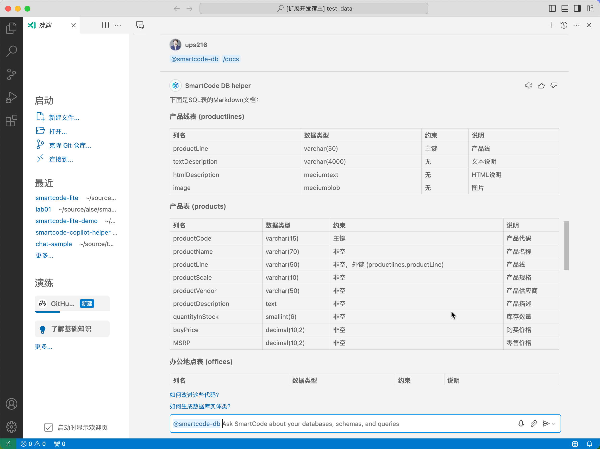
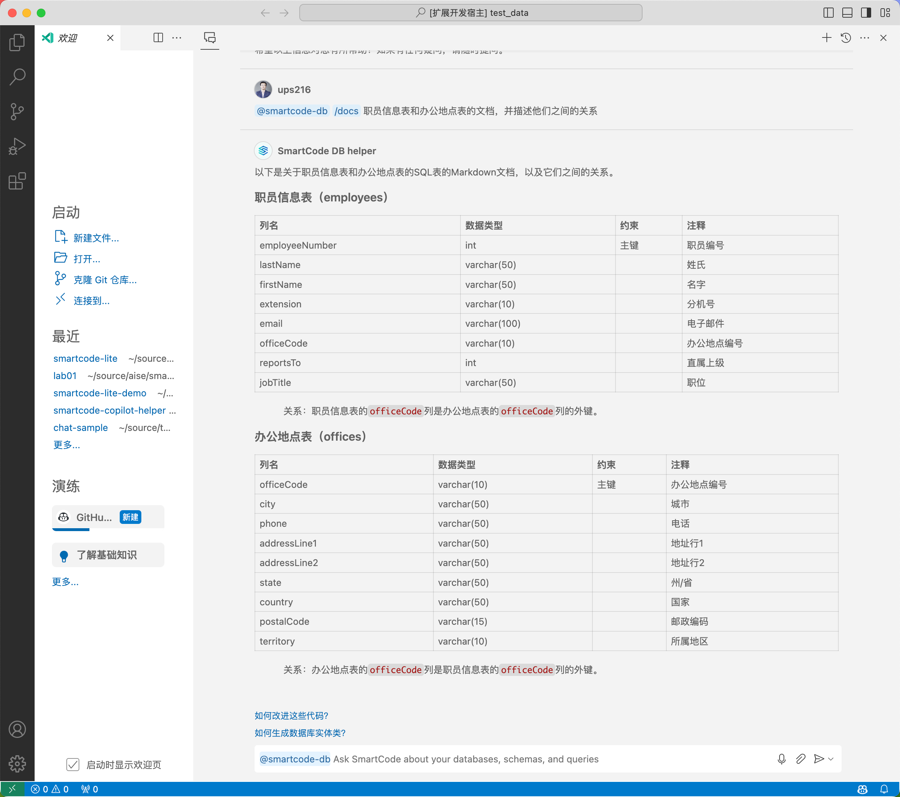

# Lab01：SmartCode for GitHub Copilot 数据库智能体使用体验

## 03 生成数据库结构化文档

利用生成式AI的能力，我们可以完成很多工作，特别是很多重复性的工作。类似文档编写这种工作，就非常适合利用生成式AI的能力来完成。在这个实验中，我们将利用 SmartCode 中预制的 `提示词` 完成数据库文档的生成工作。

> 注意：这个演示中的提示词是一个高度简化的版本，SmartCode Lite 正式版中所使用的提示词会更加复杂，以便可以达到更标准更稳定的模型输出。

### 步骤 1 - 调用文档生成快捷键进行文档生成

在 Chat 窗口中输入 `@smartcode-db /docs` 并直接回车

> 注意：当你输入 / 的时候，会列出 SmartCode 所提供一系列快捷键，您可以直接用键盘或者鼠标选定这些快捷键即可。

此时 SmartCode 给出了使用表格方式输出的规范的数据库文档

### 步骤 2 - 生成特定表的文档

在 Chat 窗口中输入 `@smartcode-db /docs 职员信息表和办公地点表的文档，并描述他们之间的关系` 并直接回车

点击进入下一步实验：

[下一步：04 利用数据库问答结果提高代码生成准确率](./04-generate-code.md)