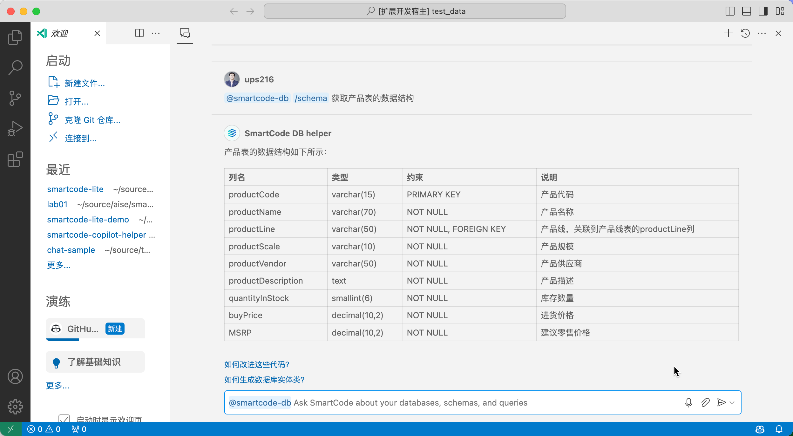
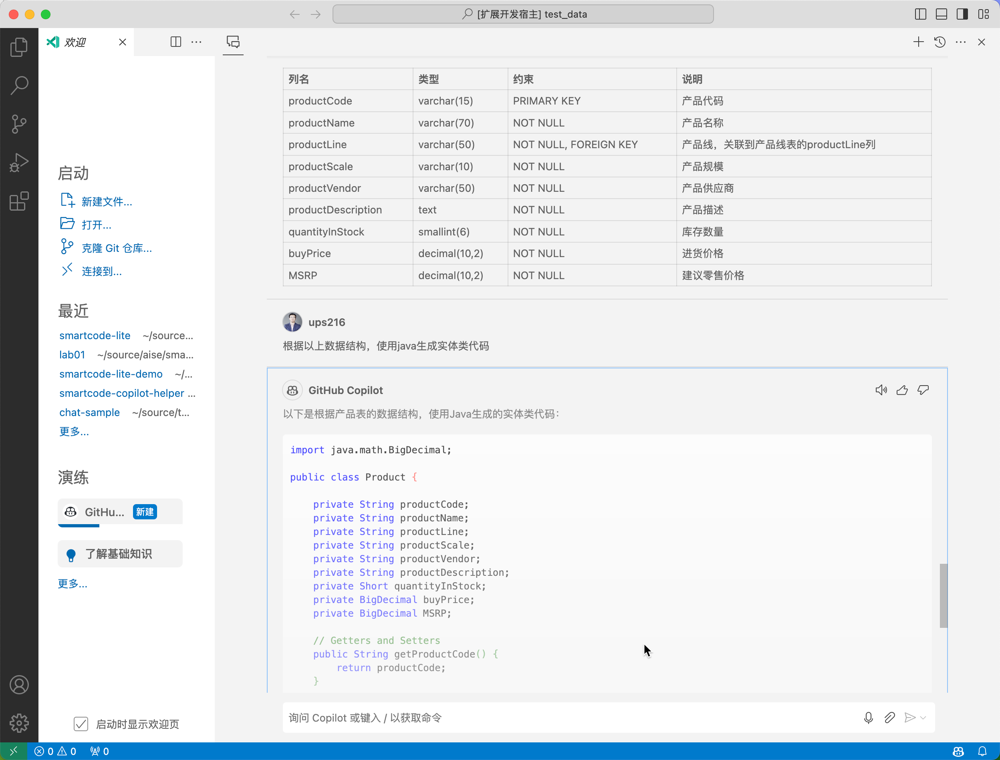

# Lab01：SmartCode for GitHub Copilot 数据库智能体使用体验

## 04 利用数据库问答结果提高代码生成准确率

SmartCode Lite 智能体不仅仅可以独立工作，也可以和 GitHub Copilot 配合工作，帮助 GitHub Copilot 生成更加准确的代码。如果把 GitHub Copilot 也当作一个智能体，我们通过插件创造了一个 `开发者+SmartCode + GitHub Copilot` 的多智能体互动环境，利用Chat上下文，让信息在多个智能体之间流动，实现我们最终的生成任务。

> GitHub Copilot是当前 AI智能编码 领域中代码生成率准确率和采纳率最高的产品，但是对于数据库相关的代码生成仍然是比较难以解决的问题。其难点在于GitHub Copilot很难直接接入企业内部的数据库来获取数据结构信息，同时由于数据库种类繁多并且企业中的数据库结构复杂，规模也比较大，简单的将数据库结构脚本发给GitHub Copilot 也无法获得很好的使用效果。

### 步骤 1 - 获取数据结构说明

使用 `@smartcode-db /schema 获取产品表的数据结构` 指令来生成 `产品表` 的数据结构描述。

### 步骤 2 - 使用GitHub Copilot生成数据库实体类

现在我们可以直接调用GitHub Copilot，并要求根据上下文生成对应的数据库实体类。在Chat窗口中删除 `@smartcode` 标签，直接输入以下提示词

- 根据以上数据结构，使用java生成实体类代码

> 以上可以看到，GitHub Copilot 根据 SmartCode 所提供的数据结构schema准确的完成了实体类的生成。

实验结束。

点击返回首页：

[Lab01：SmartCode for GitHub Copilot 数据库智能体使用体验](./README.md)